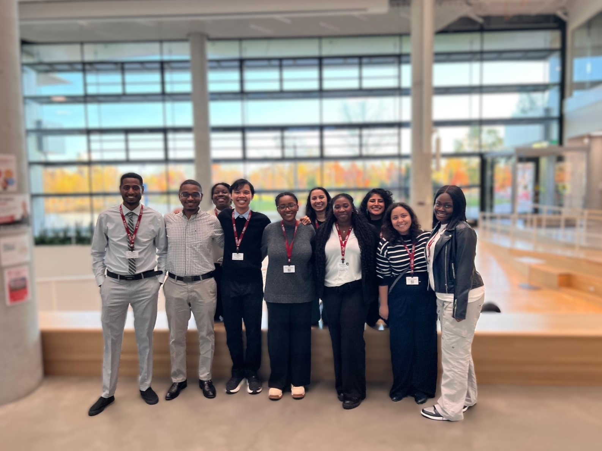
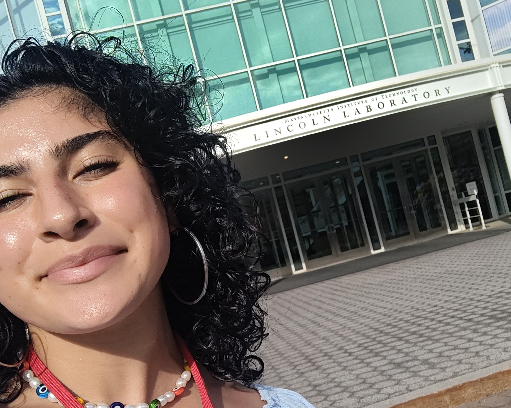

# Lydia Isabela Calderón-Aceituno 

I am a 2nd year Ph.D. student at Cornell University studying aerospace engineering under the guidance of Kirstin Hagelskjaer Petersen. My PhD is supported by the [National GEM Consortium](https://www.gemfellowship.org/), and I am a [Cornell Graduate School Dean's Scholar.]([https://diversity.cis.cornell.edu/financial-support/](https://gradschool.cornell.edu/diversity-inclusion/signature-initiatives/graduate-school-deans-scholars/)) 

---
## Research
### Swarm robotics: How can a whole is greater than the sum of its parts? 

My research attempts to answer this question by drawing inspiration from nature, where we often see groups of hundreds or thousands of simple individuals acting together as a collective to achieve complex tasks. I aim to find the algorithmic and mechanical mechanisms that make this behavior possible and to try my best to emulate them and utilize them for good. 

---
## Research
### Swarm robotics 
My research seeks to answer a simple question: how can we make it so that the whole is greater than the sum of its parts? 

Swarm robotics seeks to do exactly this by drawing inspiration from nature, were we often see groups of hundreds or thousands of simple individuals, acting together as a collective to acheive complex tasks. Our task is to find the algorithmic and mechanical mechanisms which make this behavior possible, and to try our best to emmulate and utilize it for good. 

----
## Recent News
- **Participant at the Ivy Collective for Inclusion in Engineering Doctoral Symposium** - *Harvard University, November 2024*  
  I was invited to attend the Ivy Collective for Inclusion in Engineering Doctoral Symposium at Harvard University in Cambridge, MA along with other Ph.D. students from multiple fields of study across Cornell. 
   <!-- Embed images here with descriptive alt text -->
- **MIT Lincoln Lab Research** - *Lexington, Massachusetts, Summer 2024*
  As a GEM Fellow, I did a summer of research with my industry sponsor, MIT Lincoln Labs. My research focused primarily on full-stack development of a system for   formation control and recovery in groups of autonomous vehicles with Ackermann steering.
  
  
## Contact
- [Email](mailto:lic27@cornell.edu)
- [LinkedIn](https://www.linkedin.com/in/lydia-calderón-aceituno/)